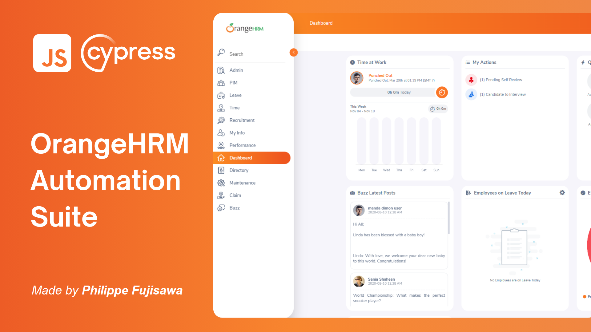

# OrangeHRM Cypress Automation

_This is my test automation project for the OrangeHRM application, a website structured for HR. My automation was developed to validate some of the system's main functionalities. I structured it using the Page Object Model (POM) pattern, which facilitates both organization and maintenance of the tests._

**Para README em Português acessar no repositório o documento README-PTBR.md**

## Automated Functionalities
**Automation of the following scenarios:**

1. Login with Valid Credentials

2. Login with Invalid Credentials

3. Logout

4. Registration of a New User

5. Editing User Information

**Integrated with CI/CD using GitHub Actions**

## Project Structure
I used the Page Object Model pattern to organize the code, separating the logic of each page into specific classes. This approach makes the code more modular, easier to maintain, and scalable, simplifying future additions of new tests.

### Future Improvements
I plan some enhancements for the project, including:

+ **Expansion of Test Scenarios:** I aim to broaden the scope to include more scenarios.
+ **Implementation of Detailed Reports:** I want to add a detailed report generator to provide a clearer view of the test results.

## How to Run the Project
### Prerequisites
Before starting, make sure you have installed:
+ [Node.js](https://nodejs.org/pt)
  
**Note:** If you do not have a browser installed, Cypress will use Electron by default to run the tests.  
To increase diversity and make test data more dynamic, I integrated the Chance library into the project.
It generates random data, such as usernames and ID numbers, among other things.
This helps avoid repeating the same data in tests, providing more realism and coverage in the tested scenarios.

+ To Install:
```
npm install chance
```

### Installation Steps

1. **Clone the repository** to your local machine:
```
git clone https://github.com/philfujisawa/orangehrm-cypress-automation.git
```
2. **Navigate to project directory.** Choose directory based on where you cloned the repository:
```
cd path/to/directory/orangehrm-cypress-automation
```
3. **Install the project dependencies:**
```
npm install
```
4. **Run Cypress** to execute the tests:
   
To open Cypress with GUI (Graphical User Interface):
   
```
npx cypress open
```
Or, to run in headless mode (no GUI):
```
npx cypress run
```
Thank you so much!